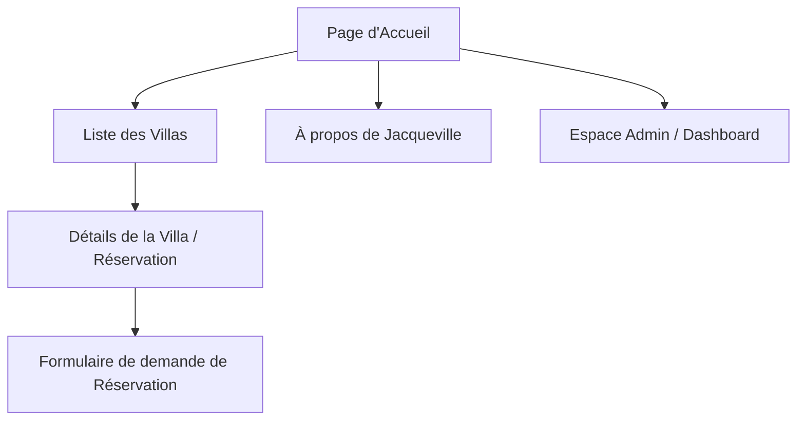
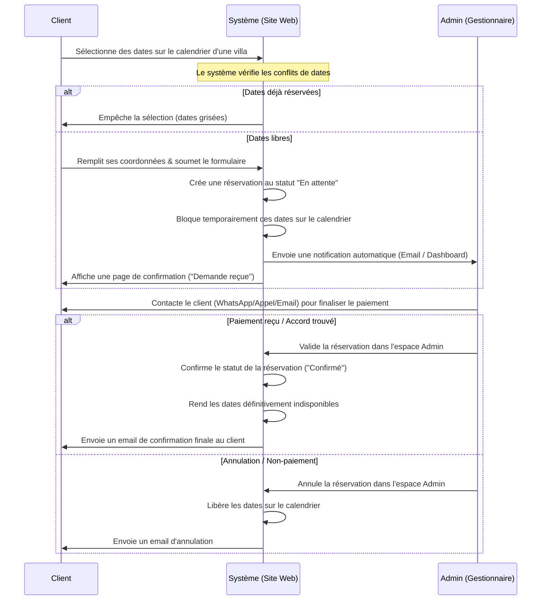

# Cahier des Charges Technique et Fonctionnel
## Site Web de Location Saisonnière — Jacqueville, Côte d'Ivoire

Ce document définit les spécifications fonctionnelles, techniques et graphiques pour la création du site web de location saisonnière de prestige à Jacqueville.

---

## 1. Présentation Générale du Projet

### 1.1 Contexte et Objectifs
Le projet consiste à concevoir et développer une plateforme web haut de gamme pour la location saisonnière de villas situées à Jacqueville, Côte d'Ivoire. Jacqueville, réputée pour ses plages de sable fin, ses cocotiers et sa double façade (mer et lagune), attire une clientèle locale et internationale à la recherche de détente et de prestige.

L'objectif principal du site est de :
*   **Valoriser le catalogue** des villas de manière immersive (visuels, vidéos, équipements).
*   **Faciliter la prise de contact et la réservation** via un système de calendrier en temps réel simple et intuitif.
*   **Permettre au gestionnaire** de valider les demandes de réservation et de finaliser les transactions hors ligne (mobile money, virement, espèces) grâce aux coordonnées clients récoltées.

### 1.2 Cible (Audience)
*   **Clients potentiels** : Familles, couples, groupes d'amis, professionnels ou expatriés cherchant un séjour reposant ou un événement en bord de mer.
*   **Administrateur / Gestionnaire** : Équipe locale chargée de la réception des demandes, de la relation client, de l'entretien et de la planification des séjours.

---

## 2. Identité Visuelle et UX/UI

L'identité visuelle doit inspirer le luxe discret, la sérénité et le professionnalisme. L'expérience utilisateur (UX) doit être fluide, invitant au voyage dès la première seconde.

### 2.1 Palette de Couleurs (Inspirée de la Nature de Jacqueville)
Le site utilisera une palette harmonieuse évoquant la mer, le sable fin et la végétation locale :

| Couleur | Code HEX (Exemple) | Rôle dans l'interface | Émotion / Évocation |
| :--- | :--- | :--- | :--- |
| **Bleu Azur** | `#007799` / `#008B99` | Boutons principaux, liens actifs, accents | La mer limpide, le ciel dégagé, la fraîcheur |
| **Sable / Beige** | `#F5EBE6` / `#F0E3D3` | Arrière-plans secondaires, cartes, séparateurs | Le sable fin de Jacqueville, la chaleur douce |
| **Blanc Pur / Off-white**| `#FFFFFF` / `#FAFAFA` | Fond principal, clarté, respiration de l'interface| Élégance, minimalisme, propreté |
| **Bleu Nuit Profond** | `#0F2027` | Typographie principale, headers, pieds de page | Le prestige, le contraste haut de gamme, le ciel étoilé |

### 2.2 Typographie
*   **Titres** : Une police serif moderne et élégante (ex: *Playfair Display* ou *Outfit*) pour accentuer l'aspect haut de gamme et hôtelier.
*   **Corps de texte** : Une police sans-serif très lisible et épurée (ex: *Inter* ou *Plus Jakarta Sans*) pour un confort de lecture optimal.

### 2.3 Éléments Graphiques et Micro-animations
*   **Effets de Glassmorphism** (verre dépoli) sur les menus et les fenêtres modales pour donner une impression de modernité et de légèreté.
*   **Hover effects fluides** sur les boutons et les cartes des villas (changement de couleur progressif, zoom léger sur les images).
*   **Transitions douces** entre les pages ou lors du défilement (fade-in, slide-up).

---

## 3. Spécifications Fonctionnelles

### 3.1 Structure du Site (Architecture des Pages)

#### A. Page d'Accueil (`/`)
*   **Section Héro** : Vidéo de fond de Jacqueville (mer, cocotiers), accroche percutante ("Échappez-vous à Jacqueville"), et un sélecteur rapide de dates / nombre de personnes.
*   **Introduction** : Présentation du concept et du standing des résidences.
*   **Sélection de Villas** : Mise en avant de 3 villas phares sous forme de cartes élégantes avec prix et bouton "Découvrir".
*   **Avis clients & Témoignages** : Carrousel d'avis de clients satisfaits.

#### B. Liste des Villas (`/villas`)
*   **Filtres de recherche** : Capacité (nombre de chambres/lits), prix par nuitée, équipements (piscine, accès plage, Wi-Fi, climatisation).
*   **Grille de cartes** : Chaque villa est présentée avec sa photo principale, son titre, son prix par nuit, son emplacement exact (ex: "Bord de mer", "Côté Lagune") et ses équipements majeurs sous forme d'icônes épurées.

#### C. Détails de la Villa (`/villas/[slug]`)
*   **Galerie Médias** : Curateur de photos haute définition et intégration de la vidéo de présentation de la villa.
*   **Description détaillée** : Texte descriptif de la villa, nombre de voyageurs maximum, chambres, salles de bain, etc.
*   **Équipements détaillés** : Liste catégorisée (Cuisine, Extérieur, Sécurité, Divertissement).
*   **Calendrier de Disponibilité Interactif** :
    *   Affichage en temps réel des jours réservés (grisés et non sélectionnables) et des jours disponibles.
    *   Sélection fluide d'une plage de dates (Date d'arrivée et Date de départ).
*   **Formulaire de Réservation** (intégré ou en panneau latéral flottant) :
    *   Rappel des dates sélectionnées et calcul du prix total estimé (Prix/Nuit × Nombres de nuits).
    *   Champs requis : Nom complet, Adresse email, Numéro de téléphone (WhatsApp de préférence), Message/Demande particulière.

#### D. Page "À propos de Jacqueville" (`/jacqueville`)
*   Section éditoriale valorisant la ville : son histoire, ses attractions (plages, canaux, restaurants de poissons, balades en pirogue).
*   Guide pratique et conseils de voyage pour donner envie aux clients de réserver et de découvrir la région.

#### E. Espace Administration (`/admin`)
*   Accès sécurisé pour le gestionnaire.
*   **Dashboard** : Vue d'ensemble des réservations en attente, validées et annulées.
*   **Gestion des réservations** :
    *   Liste chronologique des demandes.
    *   Fiche de détail par demande avec les coordonnées du client (Nom, Tel, Email) et ses dates.
    *   Actions rapides : **Valider la demande**, **Marquer comme Payé**, **Refuser/Annuler**.
*   **Gestion du calendrier manuel** : Possibilité pour l'admin de bloquer des dates manuellement (pour maintenance ou réservations prises par un autre canal comme WhatsApp ou Booking.com).
*   **Gestion du catalogue** (Ajout/Modification/Suppression de villas, tarifs, photos).

---

## 4. Workflows Clés

### 4.1 Processus de Réservation & Disponibilités en Temps Réel

### 4.2 Système de Notifications
*   **Notification Admin** :
    *   **Canal principal** : Email automatique envoyé à l'adresse du gestionnaire dès soumission du formulaire.
    *   **Contenu de l'email** :
        *   Nom de la villa demandée.
        *   Dates du séjour (Arrivée / Départ) et nombre de nuits.
        *   Coordonnées du client : **Nom complet**, **Numéro de téléphone**, **Email**.
        *   Montant total estimé.
        *   Lien direct vers l'espace admin pour valider/rejeter.
    *   **Canal secondaire** : Notification push ou alerte visuelle directement sur le dashboard Admin du site.

---

## 5. Spécifications Techniques et Architecture

Pour garantir une expérience premium, rapide et sécurisée, l'architecture suivante est préconisée.

### 5.1 Technologies Recommandées

*   **Frontend & Framework** : **Next.js** (React) ou **React + Vite**
    *   *Justification* : Permet d'avoir des performances optimales (Server-Side Rendering pour le SEO ou Static Site Generation avec hydratation) et des transitions de pages fluides.
*   **Styling** : **Tailwind CSS** ou **Vanilla CSS** structuré (CSS Modules)
    *   *Justification* : Pour mettre en œuvre l'identité visuelle moderne avec des transitions fluides et un design adaptatif de manière rapide et propre.
*   **Gestion des états & Calendrier** : Bibliothèques légères et interactives comme `react-day-picker` ou `date-fns` adaptées pour le calendrier interactif.
*   **Base de Données & Backend** : **Supabase** (PostgreSQL) ou **Node.js + SQLite/PostgreSQL**
    *   *Justification* : Supabase offre une base de données PostgreSQL temps réel intégrée avec authentification (pour l'admin) et écoute des changements en temps réel, idéale pour mettre à jour instantanément les disponibilités sur les calendriers de tous les utilisateurs sans rechargement.
*   **Envoi d'Emails** : **Resend** ou **SendGrid** via API
    *   *Justification* : Délivrabilité optimale des notifications email envoyées au gestionnaire et aux clients.

### 5.2 Schéma de Données Simplifié (Modèle de Données)

#### Table `Villas`
*   `id` (UUID, Clé primaire)
*   `title` (String) - Nom de la villa (ex: "Villa L'Étoile d'Azur")
*   `description` (Text)
*   `price_per_night` (Decimal) - Tarif par nuitée
*   `capacity` (Integer) - Nombre de voyageurs max
*   `amenities` (Array of Strings) - Équipements
*   `images` (Array of Strings) - Chemins ou URLs des images/vidéos
*   `created_at` (Timestamp)

#### Table `Bookings`
*   `id` (UUID, Clé primaire)
*   `villa_id` (UUID, Clé étrangère vers `Villas`)
*   `client_name` (String)
*   `client_email` (String)
*   `client_phone` (String) - Numéro de téléphone / WhatsApp
*   `start_date` (Date) - Date d'arrivée
*   `end_date` (Date) - Date de départ
*   `total_price` (Decimal)
*   `status` (Enum: `pending` [En attente], `confirmed` [Confirmé], `cancelled` [Annulé])
*   `notes` (Text) - Message ou demande particulière du client
*   `created_at` (Timestamp)

---

## 6. Contraintes Non-Fonctionnelles

### 6.1 Performance et Vitesse de Chargement
*   Les images des villas doivent être optimisées (formats modernes comme **WebP** ou **AVIF**) et chargées de manière paresseuse (*lazy loading*).
*   Score de performance Lighthouse supérieur à 85 sur mobile et 95 sur ordinateur.

### 6.2 Référencement Naturel (SEO)
*   Balises de métadonnées uniques pour chaque villa (titres contenant "Location villa Jacqueville - [Nom de la Villa]").
*   Structure sémantique HTML5 stricte (`<header>`, `<main>`, `<section>`, `<h1>`, `<h2>` ordonnés).
*   Génération d'un fichier `sitemap.xml` dynamique.

### 6.3 Sécurité
*   **Protection du calendrier** : Le système doit valider les dates côté serveur lors de la soumission de la réservation pour s'assurer qu'aucun autre utilisateur n'a réservé la même villa sur les mêmes dates entre-temps (double réservation impossible).
*   **Accès Admin sécurisé** : Authentification forte (email/mot de passe ou OTP) gérée de manière sécurisée (par exemple avec Supabase Auth).
*   **Validation des données** : Nettoyage et validation systématique de toutes les entrées utilisateurs (emails, téléphones) pour éviter les failles XSS ou injections.

### 6.4 Adaptabilité (Responsive Design)
*   Le site doit être conçu en approche *Mobile-First*, car plus de 70% des réservations saisonnières se font via smartphone en Côte d'Ivoire (notamment via des partages de liens sur les réseaux sociaux).

---

## 7. Plan de Recette (Vérification et Tests)

Pour valider l'implémentation du site, les tests suivants seront menés :

| Cas de Test | Résultat Attendu |
| :--- | :--- |
| **Réservation de dates disponibles** | La réservation passe au statut "En attente". L'admin reçoit un email et les dates apparaissent instantanément comme bloquées/grisées sur le calendrier de la fiche villa. |
| **Tentative de sélection de dates réservées** | Impossible de sélectionner les dates ou de soumettre le formulaire (le bouton de soumission est désactivé ou renvoie une erreur). |
| **Validation par l'Admin** | La réservation passe au statut "Confirmé" et un email de confirmation automatique est envoyé au client. |
| **Annulation par l'Admin** | Les dates précédemment bloquées redeviennent disponibles et sélectionnables pour tous les internautes sur le site. |
| **Affichage Responsive** | Toutes les pages (Accueil, Galerie de la Villa, Calendrier de Réservation, Espace Admin) sont ergonomiques et parfaitement lisibles sur iPhone, Android, tablettes et ordinateurs. |
